

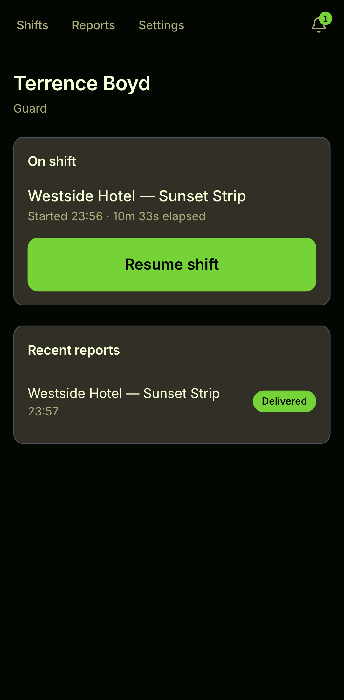
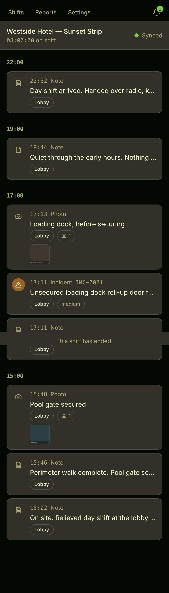
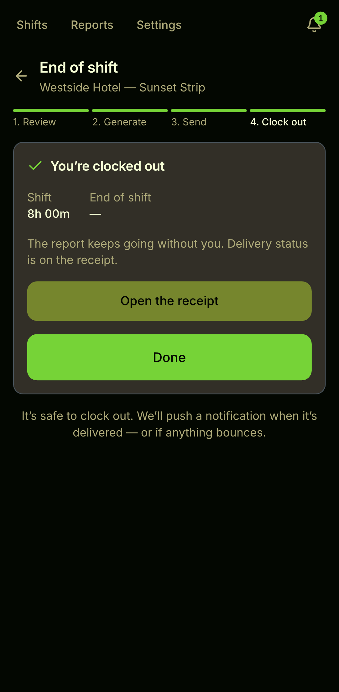
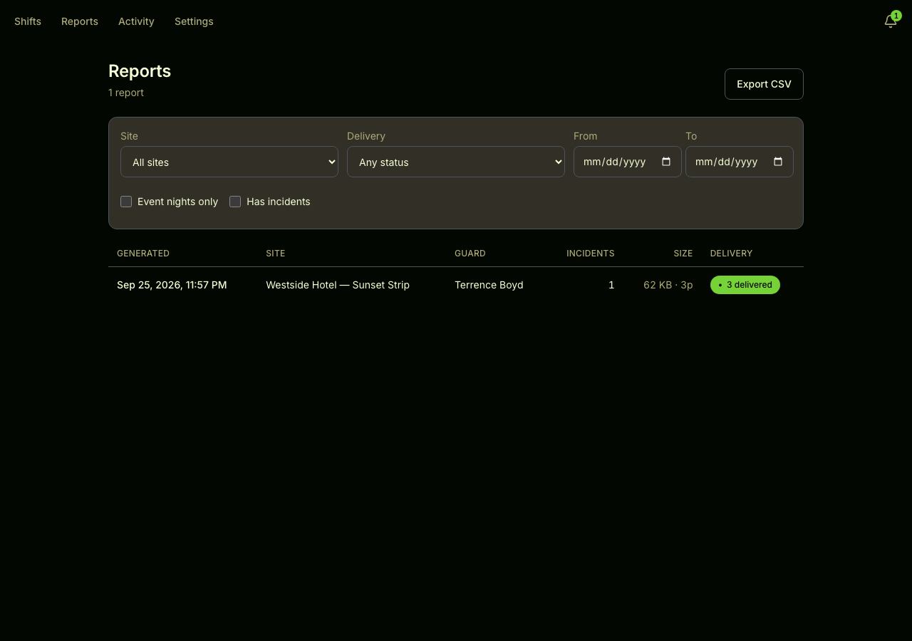
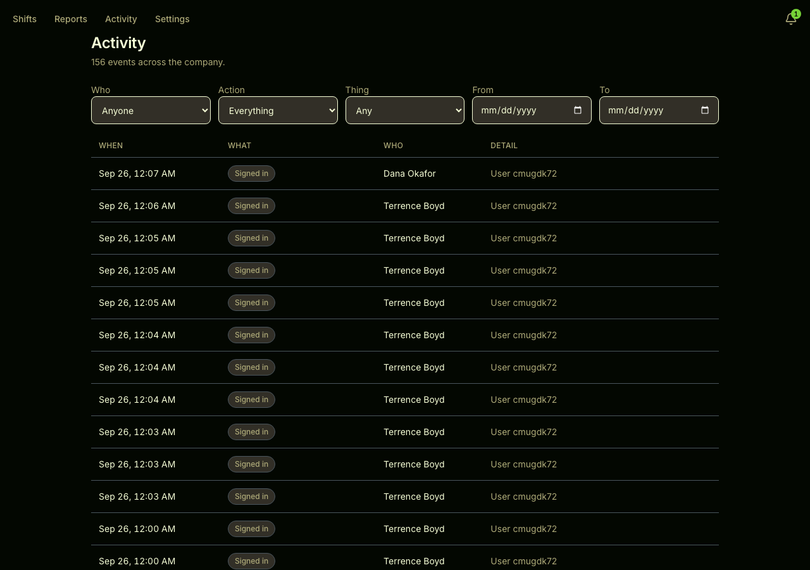
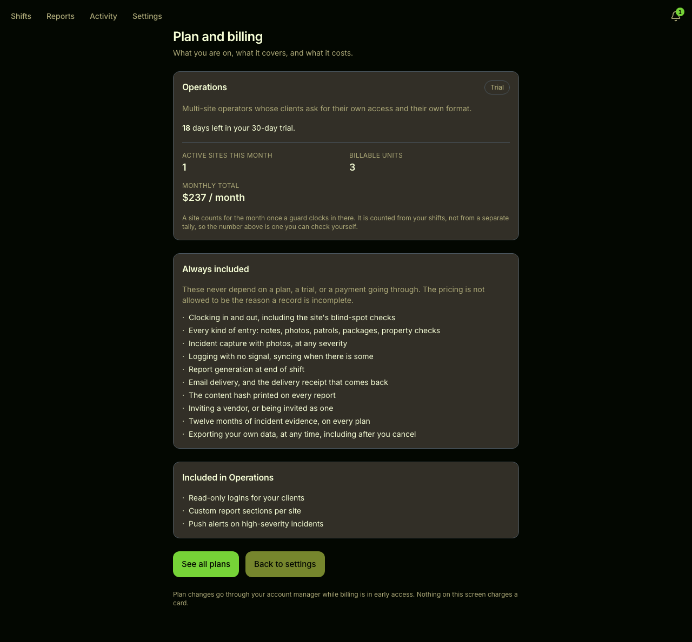

# Transient

Shift logging and reporting for contract security guards.

A guard clocks in on their phone, logs what happened as it happens — notes,
photos, incidents, patrols, property and blind-spot checks — and ends the
shift. The client gets a
PDF report in their inbox before the guard has left the parking lot, and the
supervisor can see whether it was actually delivered.

Built mobile-first and offline-first, because the people using it are standing
outside at 3am on a phone with one bar. Every entry is written locally and
queued; the timeline is honest about what has synced and what has not.

It sells to both sides of the same job: the **guard company** that needs proof
of work, and the **property or facility** that is paying for coverage and wants
to see it. Pricing for both is on the landing page.

```bash
pnpm install && cp .env.example .env
pnpm db:up && pnpm db:migrate && pnpm db:seed
pnpm dev
```

That runs the whole product — auth, uploads, PDF generation, email delivery and
push — with **no third-party account and no network**. Local fallbacks stand in
for S3, Resend and a cron scheduler. Sign in at <http://localhost:3000> as
`owner@meridian.test`; the magic link is written to `.data/outbox/`.

## Screenshots

| | |
| --- | --- |
|  |  |
| **Landing** — what it does, for both buyers | **Pricing** — guard companies and client organisations |
|  |  |
| **Dashboard** — the guard's shift, on a phone | **Timeline** — notes, photos, incidents, sync state |
|  |  |
| **End of shift** — review, then send | **Reports** — sent, delivered, opened, bounced |
|  |  |
| **Audit log** — who changed what, exportable | **Billing** — plan, seats, entitlements |

Captured by `node scripts/shots.mjs` against a real seeded database, not mocked.
The script asserts every `` decoded before it writes a file — a broken
image still produces a perfectly valid screenshot otherwise.

## Demo data

`pnpm db:seed` gives you a guard company, two sites (a hotel on `FULL` logging
and a school on `VERBAL`), three shifts, and four accounts you can sign in as:

| Account | Role | What they see |
| --- | --- | --- |
| `owner@meridian.test` | owner | everything, plus plan and billing |
| `sup.westside@meridian.test` | supervisor | reports, delivery state, audit log |
| `guard.night@meridian.test` | guard | all three seeded shifts at the hotel |
| `guard.swing@meridian.test` | guard | no shift assigned — the empty state |

`pnpm db:demo` goes further: it seeds, runs the background job sweep, seeds
again and sweeps again, which is what carries photos through thumbnailing and
reports through generation and delivery.

The order matters. The sweep is an **HTTP client** — it calls `/api/jobs/sweep`
on a running server rather than importing the job code — so:

```bash
pnpm start -p 3000 &                         # server first
SWEEP_URL=http://localhost:3000 pnpm db:demo # then the sweep
```

`SWEEP_URL` defaults to `NEXT_PUBLIC_APP_URL`, so you only need it when the
server is on a different port than `.env` says. Point it at the wrong port and
the script tells you the address is wrong instead of parroting whatever
unrelated site answered.

Email delivery is deliberately not instant: the console provider confirms a
send about 20 seconds later, so a report legitimately shows `SENT` before it
shows `DELIVERED`. Two sweeps back to back is not a bug.

## Architecture

**Next.js 16** (App Router, React 19, TypeScript strict) on **Postgres 17 via
Prisma 7**, with S3-compatible object storage for photos and generated PDFs.

Route groups mirror who is looking at the page:

| Group | Who | What |
| --- | --- | --- |
| `(marketing)` | public | landing, pricing, sample report, privacy, terms — statically generated |
| `(auth)` | anyone signing in | magic link, then a PIN for fast re-entry on a shared phone |
| `dashboard` `shift` `reports` `audit` `settings` | guards and supervisors | the authenticated app: live timeline, clock-in, end-of-shift, report status, audit log, plan and billing |
| `r/[token]` | the client | a signed public link to the report and photo gallery, no account needed |
| `g/[token]` | the client | the photo gallery on its own |
| `confirm/[token]` | the client | one-tap confirmation that they received it |

`src/lib` is split by concern — `auth`, `db`, `storage`, `email`, `pdf`, `jobs`,
`push`, `media`, `speech`, `offline`, `validators`, `billing` — so API routes
stay thin enough to read in one screen.

### How a shift becomes a delivered report

1. The guard clocks in. A `Shift` row opens and the client-side store starts
   queueing entries in IndexedDB.
2. Every entry — note, photo, incident, patrol, property check, package,
   visitor, handoff — is written locally first and synced
   when the network allows. The timeline shows per-entry sync state, so nothing
   silently disappears.
3. Photos upload to object storage as the **original**. A background job
   re-encodes a thumbnail with `sharp`, strips EXIF GPS, and marks the media
   `PROCESSED`.
4. End of shift: the guard reviews everything, then sends. A `Report` row is
   created and the PDF is rendered with `@react-pdf/renderer`.
5. One `ReportDelivery` row is created per recipient. The email provider sends,
   and its webhook moves each row through `SENT → DELIVERED → OPENED`, or
   `BOUNCED`. That status is what the supervisor sees on `/reports`.
6. Retention runs on the same sweep: old media is pruned according to the
   company's policy, and every deletion is written to the audit log.

### Media is served through a signed redirect

`GET /api/media/[id]` authorises the caller, then 307s to a presigned URL.
Uploaded bytes are served `content-disposition: attachment` — an inline `.svg`
or `.html` from a user is same-origin script. Server-**derived** variants
(a `sharp` thumbnail, a generated PDF) are the exception: they are served
inline, the permission rides inside the *signed* token so a caller cannot add
it to a URL, and a runtime allowlist limits it to `image/jpeg` and
`application/pdf`. If a thumbnail has not been built yet the URL falls back to
the original, which correctly downloads instead of rendering.

### Design system

Tokens live in `src/app/globals.css` in three layers: a literal palette, a
semantic layer that names roles rather than colours (`--surface`,
`--text-primary`, `--accent`), and a `@theme inline` bridge that makes Tailwind
utilities emit `var(--x)`. A class like `bg-surface` therefore follows the
active theme at runtime instead of freezing a value at build time.

Themes switch by toggling `.theme-dark` / `.theme-light` on `<html>`, set by an
inline pre-paint script so there is no flash of the wrong theme. The full
gallery — both themes, every primitive, every state — is at `/dev/ui`.

## Configuration

Every variable is read somewhere in the app. The ones marked **optional** have
a working local fallback, which is what lets the quick start run offline.

| Variable | Required | What it does |
| --- | --- | --- |
| `DATABASE_URL` | yes | Postgres connection. Matches `docker-compose.yml` on port 5544. |
| `DATABASE_URL_TEST` | for `pnpm test` | The `db` test project truncates every table between tests, so this **must** be a different database. Both the setup script and the test helpers refuse to run unless the name contains `test`. |
| `AUTH_SECRET` | yes | Auth.js signing key. `openssl rand -base64 32`. |
| `AUTH_URL` | yes | Absolute URL of this app. Magic links are built from it. |
| `NEXT_PUBLIC_APP_URL` | yes | Same value, exposed to the browser. |
| `LINK_SIGNING_SECRET` | yes | Signs `/r/[token]` and `/g/[token]` client links and download tokens. `openssl rand -base64 32`. |
| `CRON_SECRET` | yes | `GET /api/jobs/sweep` requires it as a bearer token. |
| `EMAIL_FROM` | yes | From address on report emails. |
| `RESEND_API_KEY` | optional | Absent → console provider writes to `.data/outbox/`. Present → real mail. |
| `RESEND_WEBHOOK_SECRET` | optional | Verifies delivery webhooks. |
| `STORAGE_DRIVER` | yes | `local` or `s3`. |
| `S3_ENDPOINT` `S3_REGION` `S3_BUCKET` `S3_ACCESS_KEY_ID` `S3_SECRET_ACCESS_KEY` `S3_FORCE_PATH_STYLE` | if `s3` | Any S3-compatible service. |
| `S3_SESSION_TOKEN` | no | Only for temporary credentials: AWS STS or an assumed IAM role. Long-lived keys (R2, MinIO) leave it unset. |
| `VAPID_PUBLIC_KEY` `VAPID_PRIVATE_KEY` `NEXT_PUBLIC_VAPID_PUBLIC_KEY` `VAPID_SUBJECT` | optional | Web Push. Absent → push is skipped and logged. `pnpm gen:vapid`. |
| `SWEEP_URL` | optional | Override the URL `pnpm jobs:sweep` calls. |

### Switching storage

Storage sits behind one interface (`src/lib/storage/driver.ts`): `put`, `get`,
`delete`, `size`, `presignDownload`. Nothing above it knows which driver is
live.

**Local** (default) writes to `./.data/uploads` and presigns with a signed
token served back through `/api/uploads/local`. No account, no container.

**S3, R2, or MinIO** — set `STORAGE_DRIVER=s3` and fill the `S3_*` block.
`docker-compose.yml` already includes MinIO with a pre-made bucket:

```bash
STORAGE_DRIVER=s3
S3_ENDPOINT=http://localhost:9000
S3_BUCKET=transient
S3_FORCE_PATH_STYLE=true      # MinIO and R2 need this; AWS does not
```

For real S3 drop `S3_ENDPOINT`, set `S3_REGION`, and leave path style off.

**Cloudflare R2** is what the deployed build uses. It is S3-compatible with
long-lived keys, so `S3_SESSION_TOKEN` stays unset. Create the bucket, then an
R2 API token (Account → R2 → Manage API Tokens) scoped to Object Read & Write;
that screen is the only place the secret is shown.

```bash
STORAGE_DRIVER=s3
S3_ENDPOINT=https://<account-id>.r2.cloudflarestorage.com
S3_REGION=auto
S3_BUCKET=transient-media
S3_ACCESS_KEY_ID=<R2 access key id>
S3_SECRET_ACCESS_KEY=<R2 secret access key>
S3_FORCE_PATH_STYLE=true
```

R2's region is the literal string `auto`, and egress is free, which is the
reason to prefer it here: this app serves photo galleries and report PDFs to
clients, so egress is the cost that would otherwise grow with usage.

Some providers issue *temporary* credentials instead, signing with three fields
rather than two — AWS STS, an assumed IAM role, or Supabase Storage (access key
id = project ref, secret = anon key, `S3_SESSION_TOKEN` = service-role JWT).
Handed only the first two those answer `InvalidAccessKeyId` on every request.
R2 does not need this.

Add the bucket's public origin to the CSP in `next.config.ts` — the config
already threads a `storageOrigin` into `img-src`, `media-src` and `connect-src`
for exactly this.

### Switching email

Same shape (`src/lib/email/`): a provider interface with two implementations.
With `RESEND_API_KEY` unset, `ConsoleEmailProvider` renders each message to
`.data/outbox/*.html` plus a `.json` sidecar carrying the magic-link URL, and
simulates a delivery webhook so status tracking works offline. Set the key and
`RESEND_WEBHOOK_SECRET` to switch to Resend; point its webhook at
`POST /api/webhooks/resend`.

To add a third provider, implement the interface and register it — the report
pipeline talks to the interface, never to a vendor SDK.

### Adding a site

A **Site** is a place a guard is posted. It belongs to a `Company` and carries
its own areas, blind spots, entry types, logging mode, report footer and
recipients.

**Recipients have a UI; sites do not.** A supervisor or above can add, edit,
re-verify and remove recipients at `/sites/<id>/recipients`, reached from the
dashboard whenever an address bounces or has not confirmed. Everything else —
sites themselves, areas, blind spots, entry types and shift schedules — is
created in `prisma/seed.ts` and applied with `pnpm db:seed`, which upserts, so
editing and re-running is safe. Copy the `hotel` block near the top:

```ts
const site = await prisma.site.upsert({
  where: { companyId_code: { companyId: company.id, code: "WH" } },
  update: {},
  create: {
    companyId: company.id,
    name: "Westside Hotel — Sunset Strip",
    code: "WH",
    address: "8400 Sunset Boulevard, West Hollywood, CA 90069",
    timezone: "America/Los_Angeles",
    loggingMode: LoggingMode.FULL,
    sendIndividually: true,
  },
});

await upsertAreas(site.id, ["Lobby", "Loading dock"]);
await upsertBlindSpots(site.id, [["Garage P2", "No camera past the ramp"]]);
await upsertEntryTypes(site.id, [...]);      // what the guard can log here
await upsertShiftTemplates(site.id, [...]);  // the recurring posts
await upsertRecipients(site.id, [
  {
    name: "Ops",
    email: "ops@client.test",
    roleLabel: "Operations Manager",
    required: true,
    status: RecipientStatus.VERIFIED,
  },
]);
```

`loggingMode` decides how much the guard is asked for: `FULL`, `LIGHT` for
posts that mostly need presence, or `VERBAL` for dictation-first. Blind spots
are surfaced to the guard as known gaps in camera coverage rather than hidden
in a config file. `sendIndividually` gives each recipient their own delivery
row, so one bounce does not hide behind three successes — the second seeded
site deliberately has neither recipients nor delivery tracking, so both paths
are exercised.

Everything is scoped to the company on the session. A user from one company
cannot read another's sites — `tests/db/` asserts that directly, and
`check-auth` re-proves it through the browser.

## Deploying to Vercel

1. Push the repo and import it. Framework detection handles the build.
2. Provision Postgres (Neon is what this deploy uses) and set `DATABASE_URL`.
   Migrations do not run themselves — apply them with
   `DATABASE_URL=<direct url> pnpm db:deploy` before the first request.
3. Set every **required** variable above. `AUTH_URL` and `NEXT_PUBLIC_APP_URL`
   must be the real `https://` origin — CSP emits
   `upgrade-insecure-requests` only when they are https, so an http value
   quietly opts out.
4. Set `STORAGE_DRIVER=s3` with real credentials. The local driver writes to
   the filesystem, which does not survive a serverless instance.
5. Set `RESEND_API_KEY` and point the Resend webhook at
   `https://<your-domain>/api/webhooks/resend`.
6. Add a cron for the sweep. In `vercel.json`:

   ```json
   { "crons": [{ "path": "/api/jobs/sweep", "schedule": "*/10 * * * *" }] }
   ```

   Vercel sends its own bearer token, so `CRON_SECRET` must match it. Nothing
   in this repo applies migrations automatically — run `pnpm db:deploy`
   against the production database **before** promoting a build that needs a
   new column.

## Testing

```bash
pnpm verify        # typecheck → lint → format → contrast gate → unit tests
pnpm test:e2e      # Playwright, at both 390px and 1280px
```

`pnpm verify` runs `format:check`, so run `pnpm format` first if you have been
editing.

Database tests need a second database:

```bash
pnpm db:test:setup     # creates and migrates transient_test
pnpm test
```

### Browser gates

These drive a real browser against a running server and are the evidence
behind most claims in this README. Start a server, then point them at it:

```bash
pnpm start -p 3000 &
BASE=http://localhost:3000 AUTH_URL=http://localhost:3000 node scripts/check-landing.mjs
```

| Gate | What it proves |
| --- | --- |
| `check-ui` | Both themes compute to different colours; every control is hit-testable across a full 48×48 area; the wordmark's accent dot lands on the "i", read from rendered pixels |
| `contrast` | WCAG ratios for all 35 approved pairings, with 4 known-bad pairings asserted to stay failing so the gate can be seen to fail |
| `check-auth` | Magic link, PIN, session scoping, and that a user from one company cannot reach another's data |
| `check-landing` | Both buyer paths, pricing, and that no CTA is a dead link |
| `check-first-run` | A brand-new account can get from empty to a logged shift without hitting a 404 |
| `check-shift` | Clock-in, the timeline, per-entry sync state |
| `check-logging-modes` | Every entry type, under all three logging modes |
| `check-end-of-shift` | Review and send |
| `check-report` | The PDF renders, rasterises, and contains the entries |
| `check-reports` | Delivery state is visible without opening anything |
| `check-recipients` | The dashboard's "bounced address" link resolves; only a supervisor at that company can open it |
| `check-jobs` | The sweep processes media and reports, and is authorised |
| `check-pwa` | Manifest, icons, service worker, offline shell |
| `check-billing` | Plan, seats, and that an unentitled feature is actually blocked |
| `check-lighthouse` | ≥95 mobile performance on the four public routes |

Use an explicit port. Port 3000 is a common collision, and `next start` failing
with `EADDRINUSE` while something else answers on that port produces a `200`
that proves nothing.

## Scripts

| Script | What it does |
| --- | --- |
| `pnpm dev` | Next dev server |
| `pnpm build` / `pnpm start` | Production build and serve |
| `pnpm verify` | The full headless gate. Run before committing. |
| `pnpm test` / `test:watch` / `test:e2e` | Vitest, watch mode, Playwright |
| `pnpm contrast` / `contrast:check` | Print the contrast table / fail on a violation |
| `pnpm check:ui` | Browser gate (needs a running server) |
| `pnpm db:up` / `db:down` | Postgres + MinIO containers |
| `pnpm db:migrate` / `db:deploy` / `db:reset` / `db:studio` | Prisma |
| `pnpm db:seed` / `db:demo` | Seed / seed and run the pipeline end to end |
| `pnpm db:test:setup` | Create and migrate the test database |
| `pnpm jobs:sweep` | Run the background job by hand |
| `pnpm gen:vapid` / `gen:icons` | Web Push keys / PWA icons |

## Where the decisions are written down

`ASSUMPTIONS.md` records what was decided and what is deliberately not built,
including which subscription entitlements are enforced today and which are
listed but unimplemented. Read it before quoting a capability to anyone.
